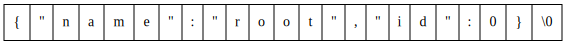
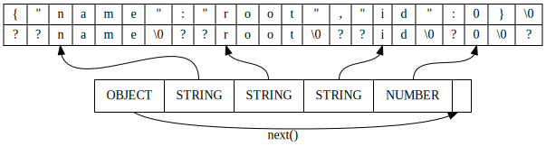

# jstr
Minimalistic fully-validating Unicode-aware JSON parser in C


Pronounced *Jester*, a pun at [JSMN/Jasmin](https://github.com/zserge/jsmn),
the parser generates a read-only JSON DOM in a caller-provided buffer.

Parsing is destructive, i.e. the parser alters JSON string as it goes. This is
primarily used to terminate tokens with `\0` characters. DOM node stores the value
(a C string) as a pointer into the JSON string. String escapes, ex: `\n`, `\uXXXX`,
are decoded in-place.

Incremental parsing is NOT supported. This decision allows to simplify the library's code
significantly. Who needs incremental parsing, seriously?

Unlike [JSMN/Jasmin](https://github.com/zserge/jsmn), the world's sloppiest JSON parser
(which touts itself as the world's fastest), Jester is not a joke!
Non-string keys in objects are prohibited, every key must have a corresponding value,
random unquoted literals are not allowed and inputs that aren't valid UTF-8 are rejected.

(Wonder how sloppy JSMN really is? Take a look at the numerous
[disabled tests](https://github.com/zserge/jsmn/blob/master/test/tests.c#L58)
in their testsuite!)

## Read-only DOM in a caller-provided buffer, you say?

Consider a JSON snippet:

```json
{"name":"root","id":0}
```

The figure below depicts it as a C string (a cell is a byte). 



The parser alters a JSON string as it goes. String escape
sequences are decoded in-place and `\0` characters are
written to terminate tokens.

The next figure shows JSON string before and after
parser invocation. Cells bearing a question mark have
undefined value.



Caller provides the parser with an array of `jstr_token_t`
objects. This array ends up storing `OBJECT`, `STRING`, `STRING`,
`STRING`, `NUMBER` tokens. Primitive tokens store a C string value —
a pointer to characters — depicted with arrows in the drawing.

`OBJECT` and `ARRAY` tokens store the number of child tokens, making it
possible to skip subtrees efficiently. Note that skipping a subtree
yields the **next sibling**. The **first child** is the next token after
the parent. These two operations are sufficient to traverse a tree, hence
we are entitled to call our token array a JSON DOM.

This data structure is convenient for tree traversal, but
modifications — insering a node, for instance — are NOT supported.
Due to this limitation we call it a **read-only** DOM.

(Technically, since tokens don't require cleanup,
a caller may mutate the buffer freely.
Convert a JSON array of strings in a JSON DOM into
a NULL-terminated array of pointers to characters in-place?
Why not!)


## Usage

```c
void jstr_init(jstr_parser_t *parser);
```

Init parser (opaque `jstr_parser_t` structure). No cleanup is necessary.

```c
ssize_t jstr_parse(
  jstr_parser_t *parser, char *json, jstr_token_t *token, size_t token_count
);
```

Parse JSON data. Returns the number of bytes consumed on success. A negative
return value indicates a failure. Possible failures:

`JSTR_INVAL (-1)` Parse error.

`JSTR_NOMEM (-2)` Token array is too small. Grow the array. Resume
the parser by calling `jstr_parse` again.

`JSTR_2BIG  (-3)` String is too large or too many tokens produced.

### Tokens

Token is an opaque `jstr_token_t` structure. No cleanup is necessary.
Token size matches the size of a pointer or exceeds it.

Use `jstr_type` function to get token's type:

```c
jstr_type_t jstr_type(const jstr_token_t *token);

typedef enum {
  JSTR_OBJECT = 0x01,
  JSTR_ARRAY  = 0x02,
  JSTR_STRING = 0x04,
  JSTR_NUMBER = 0x08,
  JSTR_TRUE   = 0x10,
  JSTR_FALSE  = 0x20,
  JSTR_NULL   = 0x40
} jstr_type_t;
```

Use `jstr_value` function to get token's value (a C string).
Don't use with `OBJECT` or `ARRAY`.

```c
const char *jstr_value(const jstr_token_t *token);
```

Use `jstr_next` to skip all chidren of the token.
Works with all token types.

```c
const jstr_token_t *jstr_next(const jstr_token_t *token);
```
